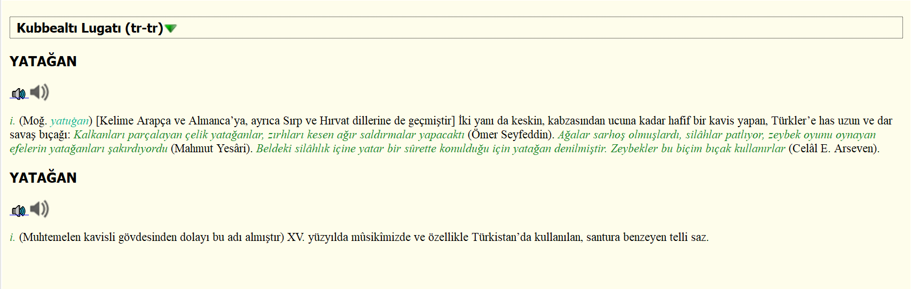
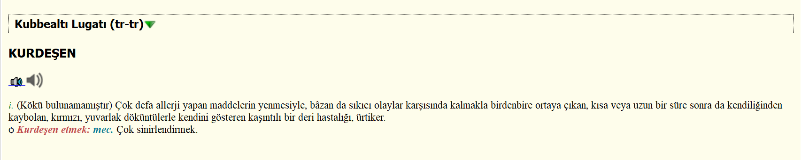
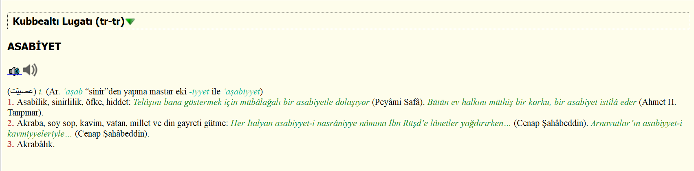

# lugatim-stardict

Türkçe kökenli sözcüklerin kökenlerinin bir türlü bulunamadığı sözlüğün (Kubbealtı Lugatı) 2023 "Edisyonu"nu StarDict, Kobo dicthtml ve Kindle MOBI biçimlerine çeviren bir Python betiği.

Veri ve ses dosyaları betikle birlikte gelmez, bunları kullanıcının kendisinin derlemesi gerekmektedir.

# Kullanımı
`python lugatim-stardict.py --help`
```
usage: lugatim-stardict.py [-h] [-d JSON] [-s] [-b {1,2,3}]

    Kubbealtı Lugatı verilerini StarDict, Kobo dicthtml ve Kindle MOBI
    biçimlerine çeviren betik.

    Eğer girdilerin ses dosyaları elinizde varsa bunları betiğin yanında yer alan
    dosyalar/sesler konumuna kopyalayın. Ses dosyalarının uzantısı önemli değildir
    ancak isimlerinin her girdinin "id"sine denk gelmesi gerekmektedir.

    Kindle dönüşümü için "kindlegen.exe" çalıştırılabilir dosyasının PATH'de olması
    gerekmektedir.

    Kobo dönümüşü için "dictgen-windows.exe" çalıştırılabilir dosyasının PATH'de olması
    gerekmektedir.


options:
  -h, --help            show this help message and exit
  -d JSON, --veri-dosyasi JSON
                        Girdilerin yer aldığı JSON dosyasının konumu. tar.gz ile sıkıştırılmış olabilir. JSON dosyasının yapısı README.md'de yer alan
                        "JSON veri dosyasının yapısı" başlığına bakın.
  -s, --ses-ekle        Ses dosyaları sözlüğe eklensin. Bu dosyalar sadece StarDict biçimine eklenmektedir.
  -b {1,2,3}, --bicim {1,2,3}
                        Sözlüğün dönüştürüleceği biçim. Geçerli seçenekler: 1 = StarDict, 2 = Kobo dicthtml, 3 = Kindle MOBI
```

## Gerekli paketler
- PyGlossary: `pip install pyglossary`
- PyICU: https://github.com/cgohlke/pyicu-build

# Ekran Görüntüleri




*Sözlüklerin Goldendict üzerindeki görünümü.*

# JSON veri dosyasının yapısı

Betiğe göstereceğiniz JSON dosyasının yapısı aşağıdaki şekilde olmalıdır.

```json
[
  ...
  {
    "pageNumber": null,
    "pageCount": 20,
    "id": 674962,
    "entityStatus": null,
    "entityVersion": null,
    "dateModified": 1677571234000,
    "modifier": null,
    "creationTime": null,
    "kelime": "A",
    "anlam": "<span class='ChampturkI150' >i. </span><br/><span class='ChampturkB150' >1. </span><span class='Champturk150' >1928 harf inkılâbından sonra kullanılmaya başlanan Latin asıllı Türk alfabesinin ilk harfi. </span>...",
    "status": 1,
    "surumId": 1,
    "baseWordId": null,
    "surum": null,
    "kelimeSiralama": "A",
    "wordSearch": "A",
    "noHtml": "i. 1. 1928 harf inkılâbından sonra kullanılmaya başlanan Latin asıllı Türk alfabesinin...",
    "anlamAksansiz": "<spAn clAss='ChAmpturkI150' >i. </spAn><br/><spAn clAss='ChAmpturkB150' >1. </spAn>...",
    "ozet": null,
    "url": null,
    "pool": true,
    "indexedTime": null,
    "indexed": null,
    "audioUrl": null
  },
  ...
]
```

# Not

Sadece StarDict sürümü GoldenDict üzerinde denenmiş, Kindle ve Kobo versiyonları cihazlar üzerinde denenmemiştir.